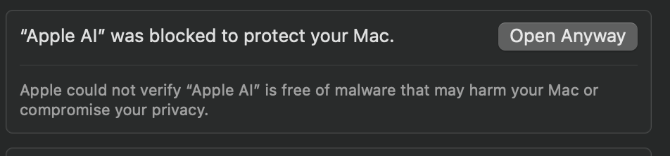

# Apple AI

A MacOS menu bar app that brings ChatGPT, Claude, Perplexity, Copilot, DeepSeek, and Grok into one streamlined interface, accessible anywhere with a global ⌘E shortcut.

## Overview

Apple AI transforms how you interact with AI tools on your Mac by bringing together powerful AI assistants in one convenient menu bar application. Access it instantly from anywhere with the global ⌘E shortcut.

Available AI services:
- ChatGPT
- Claude 
- GitHub Copilot
- Perplexity
- DeepSeek
- Grok

Each assistant maintains its own persistent session, allowing you to seamlessly switch between them while preserving context and conversation history.

## Key Features

- **Global ⌘E Shortcut**: Toggle the app window from anywhere on your Mac with Command+E
- **Always on Top Mode**: Keep the window visible even when clicking outside
- **Pinnable Interface**: Pin the AI interface to keep it accessible while working in other applications
- **Instant Menu Bar Access**: One-click access to all AI assistants from the menu bar
- **Native Performance**: Built as a native macOS app for optimal speed and reliability
- **Persistent Sessions**: Maintains context across app restarts
- **Resource Efficient**: Lightweight compared to multiple browser tabs
- **Clean Interface**: Modern, distraction-free design following macOS guidelines
- **Customizable Themes**: Light and dark mode with accent color options
- **Smart History**: Search and reference past conversations
- **Privacy Focused**: All data stored locally by default
- **Full Keyboard Support**: Copy, paste, and select all functionality in all AI chat inputs

## Keyboard Shortcuts

Apple AI provides system-wide keyboard shortcuts for quick access:

- **⌘E**: Toggle Apple AI window open/closed (works globally across all applications)
- **Copy/Paste/Select All**: Standard keyboard shortcuts (⌘C, ⌘V, ⌘A) work in all AI chat input fields
- 
The global ⌘E shortcut works from any application, giving you instant access to AI assistance whenever you need it.

## Preferences

Apple AI offers several customization options:

- **Always on Top**: When enabled, the app window stays visible even when clicking outside it
- **Open at Login**: Automatically start Apple AI when you log in
- **Keyboard Shortcuts**: View the configured keyboard shortcuts

To access preferences, click the Apple AI menu bar icon and select "Preferences".

## Usage Tips

- Use ⌘E to quickly show/hide the Apple AI window from any application
- Enable "Always on Top" when you need to reference AI responses while working in another app
- Pin the interface to keep it accessible at all times while working
- Pin the app to your menu bar for easy access
- Use standard keyboard shortcuts (⌘C, ⌘V, ⌘A) in all AI chat input fields

## Perfect For

- **Developers**: Quick access to coding assistants like GitHub Copilot
- **Writers**: Seamless writing help from ChatGPT and Claude
- **Researchers**: Efficient fact-checking with Perplexity
- **Knowledge Workers**: Rapid answers from multiple AI sources
- **Creative Professionals**: Instant creative inspiration
- **Students**: Research assistance and learning support
- **Business Users**: Quick market research and analysis
- **Data Scientists**: Rapid prototyping and code generation

## Technical Details

- Built natively for Apple Silicon and Intel Macs
- Written in Swift using SwiftUI framework
- Minimal CPU and memory footprint
- Regular updates and maintenance
- Active community support

## Installation

1. **Download & Install**
   - Visit the [Releases](https://github.com/bunnysayzz/appleai/releases) page
   - Download the latest `Apple.AI.dmg` file
   - Open the downloaded DMG file
   - Drag Apple AI.app to your Applications folder
   - Launch the app from Applications or Spotlight

2. **First Launch Security**
   - When installing Apple AI, you may encounter a security warning due to macOS's Gatekeeper feature
   - This is a normal security measure to ensure the app is from a trusted source
   
   
   - If you see a security warning, go to System Settings > Privacy & Security and click "Open Anyway"

## Security Considerations

Apple AI is designed with privacy in mind:
- The app simply provides a native interface to web-based AI services
- No data is sent to any servers beyond what you directly input to each AI service
- All preferences and settings are stored locally on your Mac

# AppleAI Update System

## Overview
This project implements a custom update system for AppleAI, a macOS menu bar application. The update system checks for new versions on AWS S3, downloads updates, and handles the installation process.

## Implemented Features
- Real-time version checking with S3
- Progress tracking during download
- Release notes display
- In-app installation and restart
- Error handling and retry mechanism

## How It Works
1. The application checks for updates against an `appcast.xml` file stored on S3
2. If a newer version is available, it downloads the update package
3. The update is extracted and installed to replace the current application
4. User is prompted to restart the application

## S3 Structure
- `/appcast.xml` - Contains version information and release notes
- `/AppleAI-x.y.z.zip` - The app update package for version x.y.z

## Local Development
- Local version is set to 1.1.0
- S3 contains version 1.1.1 for update testing
- Use the `build_and_install.sh` script to build, properly version, and install the app

## Testing Updates
1. Run the app from Applications
2. Click the menu bar icon
3. Select "Check for Updates"
4. The update process should detect version 1.1.1 and offer to install it

## Release Process
1. Update version numbers in Info.plist
2. Build the app with release configuration
3. Create a zip package of the app
4. Update appcast.xml with new version info and release notes
5. Upload both files to S3

## Scripts
- `build_and_install.sh` - Builds and installs the app locally with proper version
- `s3_upload.sh` - Uploads updates to S3 (in s3_uploads folder)

